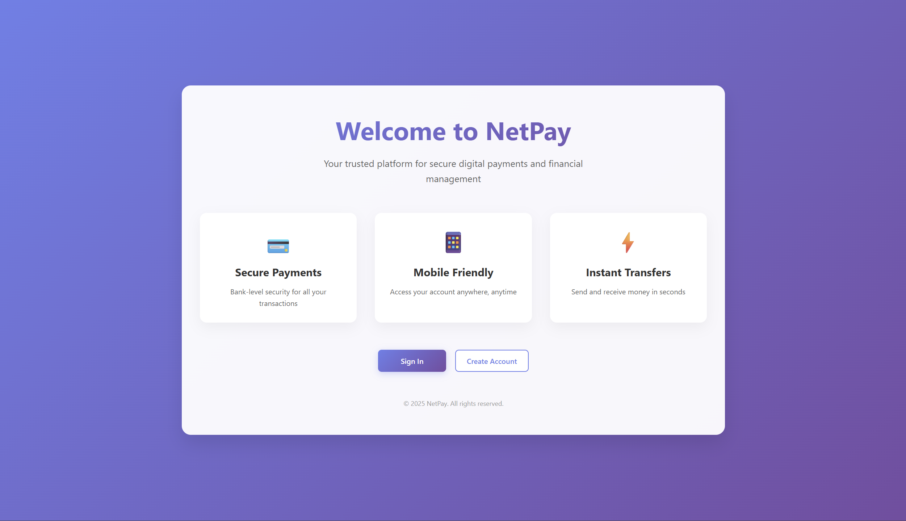
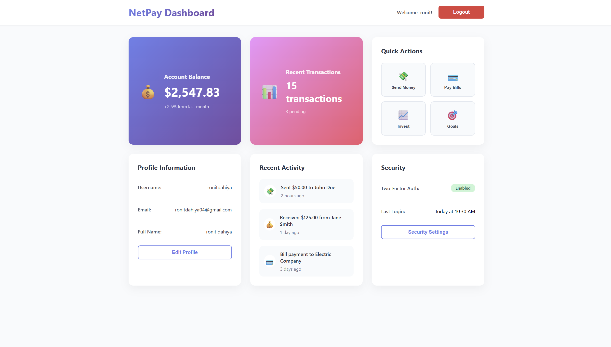

# NetPay 💳

NetPay is a full-stack web application built with **Django (backend)** and **React (frontend)**.  
It provides a secure foundation for modern web platforms with user authentication, real-time features, and planned payment integrations.

---

## 🚀 Features Completed
- ✅ Django + React setup with clean folder structure  
- ✅ Custom user model (email-based login)  
- ✅ User signup, login, and logout APIs  
- ✅ Session-based authentication with secure password hashing  
- ✅ Frontend forms and authentication state handling in React  

---

## 📌 Next Planned Features
- 🔄 Real-time chat between users (WebSockets)  
- 🔔 Notifications system  
- 💰 Payment integration (Stripe / Razorpay or custom)  
- 🛡️ Enhanced security & access control  

---

## 🛠️ Tech Stack
- **Backend:** Django, Django REST Framework  
- **Frontend:** React.js  
- **Database:** SQLite (dev) → MySQL (production)  
- **Authentication:** Session-based auth  

---

## 📸 Screenshots

### Home Page

### Dashboard Preview

